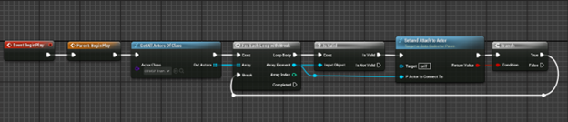

# Recording

The reason we need Airsim is to record and collect data. You can collect two types of data: camera data and sensor data.

## How to Record

### Setup

To be able to record, you need to set up a vehicle. However, due to the specific way we want our tram to work and the way Airsim sets up vehicles, we needed something a little different. That's why we added an `ActorDataCollector` actor. This actor will be spawned by Airsim but its sole purpose is to record data.

### Using ActorDataCollector

To use it, create a child from the `ActorDataCollector` actor. In that child, use the function `SetAndAttachActor()` to set which actor you want to attach to—in our case, the tram. An example of how to do this in Blueprint looks like this:



Once you have set this, the actor will automatically attach to the specified actor when the simulator starts. It will first try to find a camera on the actor to attach to, but if it can't find one, it will attach to the root of the actor.

### Python

To record data using Python, you can use the `SingleRecord` function (or any other relevant function provided by Airsim's Python API). This allows you to control the recording process programmatically.

Example Python code to start recording:

```python
import airsim

AirsimClient = airsim.CarClient()
AirsimClient.singleRecording() # start the recording

while AirsimClient.isRecording(): # will return true if it is still taking images
    time.sleep(0.1)
print('Retrieved images')

```

The singleRecording() function is a custom made function, this will take a single image from all cameras in Unreal Engine and it will save it automatically in the set folder without sending it to python first. This will make the recording faster while keeping the control that python gives.

This is a basic example, and you can find more detailed information in the Airsim Python API documentation.
By following these steps, you can effectively set up and record data using the Airsim simulator.