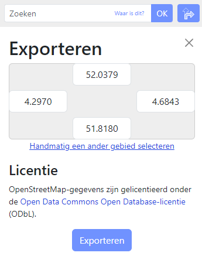

# OSM

To start, you need to select an area to export. This can be done using the OSM Exporter [here](https://www.openstreetmap.org/export#map=19/51.21044/4.39771&layers=T). City generation is based on an OSM export.

## Steps to Export OSM Data

### 1. Search for the Place of Interest

Start by searching for your place of interest:

Once you have selected your place, OSM will navigate to the center of that location:

### 2. Select an Area of Interest

To select an area of interest, follow these steps:

After pressing the export button, you will find a button on the left of your window labeled `Handmatig een ander gebied selecteren`. Click this button to proceed.

This will provide you with a selection square:

You can use this square to select an area of interest. Be careful not to make your area too big.

### 3. Export the Selected Area

Once you have selected your area, click the **Exporteren** button on the left of your screen. If your area is too big, you will be prompted to make it smaller.

If your area is of the right size, it will export a **map.osm** file:

[Download Example OSM File](../files/osm_map_example.osm)

If you want to follow along exactly, you can download my exported file or import these coordinates into the cells manually:

After completing these steps, you can move on to the next step: [Houdini Generation](./Houdini.md).
