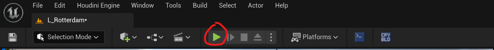
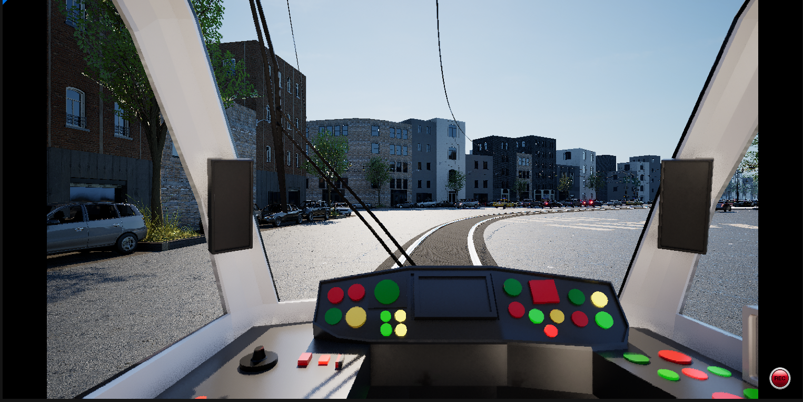
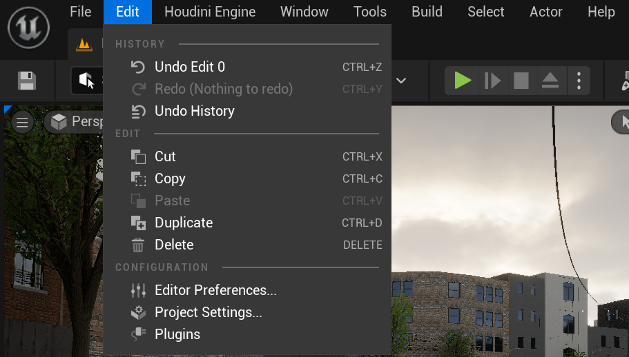
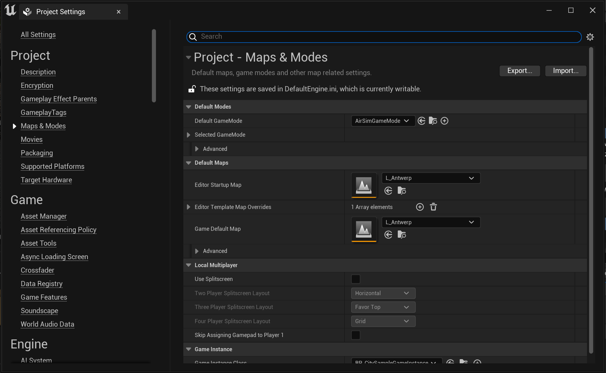
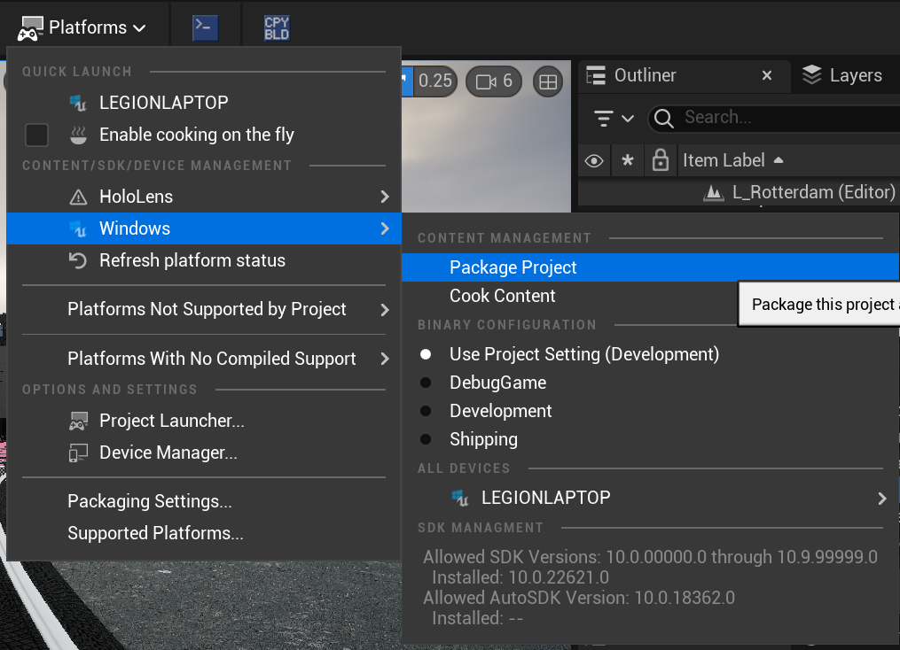

# Package the Simulator

This is the last step, it will package the simulator so you can start gathering data.

## Saving and Testing the City

After putting the whole city in Unreal Engine, first of all, you want to save it. After saving, it is also important to test it. You can press play by pressing this button on the top:

It can take a while to load everything in, so just wait for a bit. After a while, you should see the tram and vehicles appear:

If you wait a bit longer, the tram should start driving. If you see this, great job! Everything went well, and you can start building the simulator.

## How to Build the Simulator

1. **Save the Level**: Make sure the level is saved. If the name of the level has a “*” after it, it is not saved.
2. **Set the Level as Startup Level**: This should be done in the project settings. These can be found under Edit → Project Settings...

    

    It should open up another window. Navigate to Maps & Modes:

    

    Change the Game Default Map to your current map (e.g., `L_Rotterdam`). The Editor Startup Map is not important for the build but can be useful if it is a map you later want to continue working on. Setting a map there makes it the first map Unreal Engine loads when you start up your project.

3. **Package the Project**: 

    a. Go to Platforms → Windows → Package Project...

    

    b. When you click on it, you will have to set a location where you want to save the package. Make sure you put it into a location that you will remember.

    c. After confirming the location, it will start packaging. Now, you just wait for it to finish.

That's it for the packaging!
