# Fixing the streets
For more information about the street you can check the [streets plugin](../TrafficPlugin/TrafficPlugin.md)
But here you will find a simple way to fix streets and add traffic lights.

### Updating the streets
Everytime you make a change to the street it is a good habit to update it to make sure that the changes have been made.

You can select a street by clicking on it through either the [viewport](../Softwares/HowToUnrealEngine.md#viewport) or through the [outliner](../Softwares/HowToUnrealEngine.md#outliner)

Once you have selected it, it should look something like this:
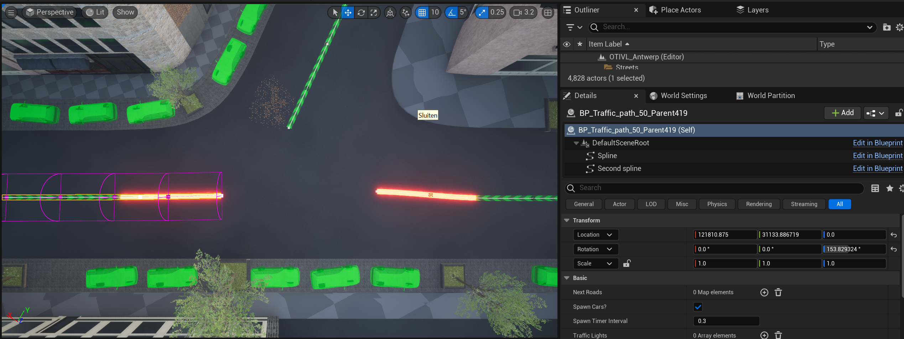

Okay now in the [details panel](../Softwares/HowToUnrealEngine.md#details-panel) you want to search for the update checkbox, it should be under the Basic tab:
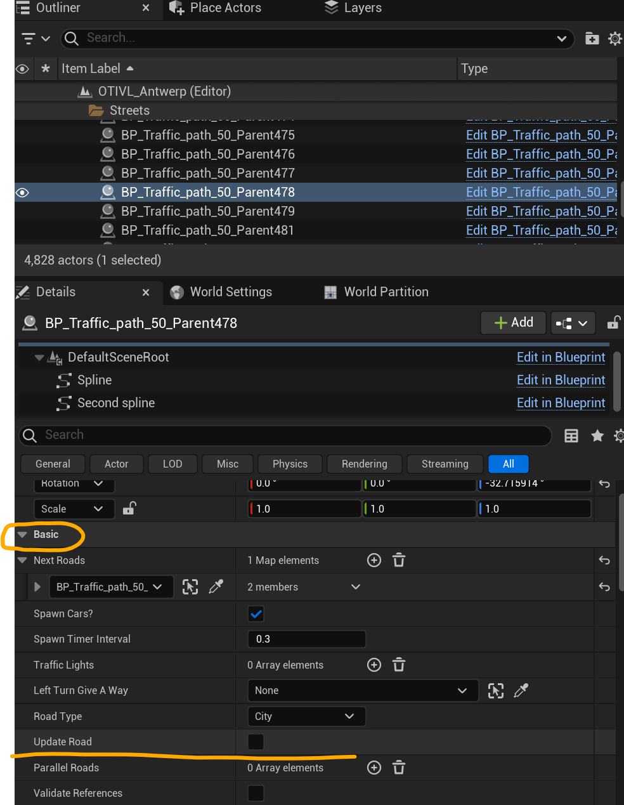

If you click on the details panel, it will look like nothing happend, the checkbox will still not be selected. This is normal, it just goes through its construction script and unchecks the boolean again, don't worry about it. But the road has been updated, you may have seen that the visual now fully follows the spline for example.

Before continuing I recommend update all roads so that all visuals are at least correct. You can select all roads at once and press the update button. Depending on the amount of streets this may make the editor hang for a while.

### Inverting the road
It may happen that the visual is pointing in the wrong direction to your oppinion and thus that the street is pointing in the wrong direction. There is a easy way to inverse the road so that it will go in the other direction, which may be nice for better intersections.

There are 3 steps:

Step 1.
Select the road, just like before select the road that you want to reverse, either through the [viewport](../Softwares/HowToUnrealEngine.md#viewport) or through the [outliner](../Softwares/HowToUnrealEngine.md#outliner), after selecting in you want to look into the [details panel](../Softwares/HowToUnrealEngine.md#details-panel). You are looking for the Invert Spline button, which can be found under the "Default" tab:
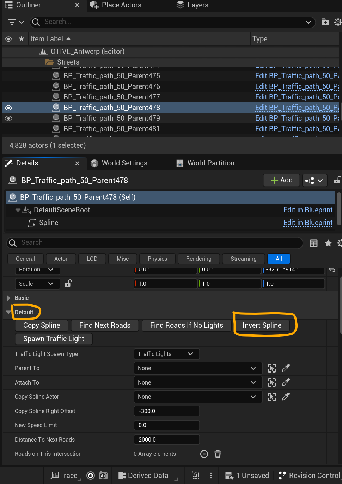

Step 2.
Once you have found the button, click on it!

Step 3.
Just like mentioned before, simply update the spline by clicking on the checkbox. You should now see the visual change and point the other direction.

### Configuring intersections / street connections
When streets are not connected to any other street they will flash red like this:

It is recommended to make sure all street are connected to something, if non vehicle that arrive at a street end will just dissapear, in some cases this doesn't matter but again it is recommended to make sure this doesn't happen.

To connect street we will need to give it a connection to another street, go on to a street that you want to connect by clicking on it through either the [viewport](../Softwares/HowToUnrealEngine.md#viewport) or through the [outliner](../Softwares/HowToUnrealEngine.md#outliner)

Once you have selected it, it should look something like this:

All settings about the roads are to be configured through the [details panel](../Softwares/HowToUnrealEngine.md#details-panel)

For the connection we want to look for the "Next Roads" variable which can be found under the "Basic" tab
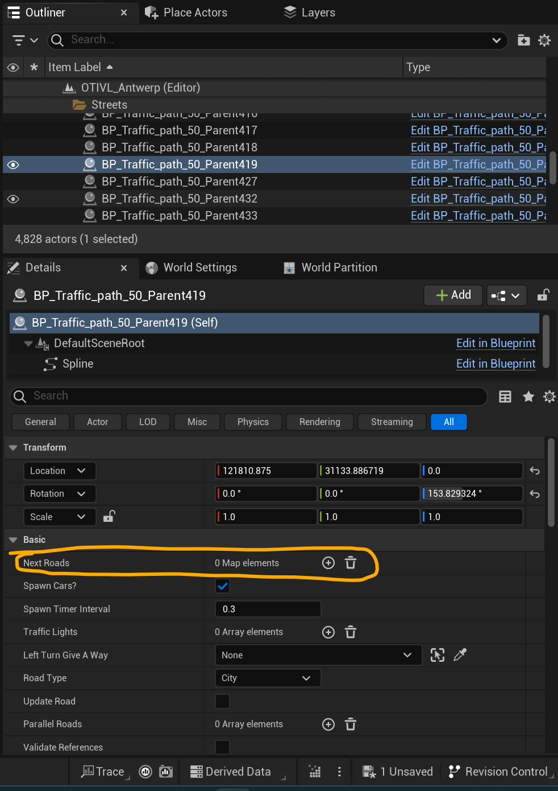

Here you want to add a new road to the list, to do this you want to press the + that is next to the variable name, this should add a new empty object to the list:
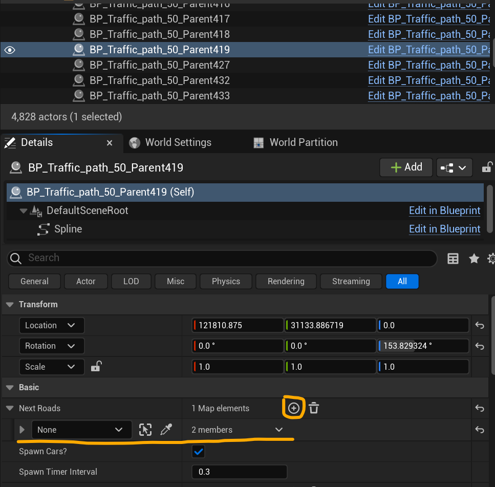
Here you want to assign a new road you want the current road to connect to, you can do this either through the dropdown menu and searching the other road by name, but it is much easier to do with the [eye dropper](../Softwares/HowToUnrealEngine.md#eye-dropper) and just selecting it in the [viewport](../Softwares/HowToUnrealEngine.md#viewport)

Important to know, when a car is at the end of its current road, it will search for the start of the next, if this is too far away it will drive straight through everything untill it has arrived at it the start of the next road so it is imported to adjust the street correctly, because this is just a spline you can do easily manipulate the way it is made. [How to adjust a spline?](../Softwares/HowToUnrealEngine.md#what-are-splines-and-how-to-use-them)

Once you have selected a road you should notice that the road is no longer flashing red, great the roads are connected. You can connect as many roads as you want but just make sure it makes sense.

### Adding traffic lights
A big part of intersections are traffic lights, this will control the traffic and add to its realism. The traffic plugin has 2 kinds of traffic lights, the normal ones and priority roads. The way to set them up is pretty much the same except for a few key difference which I will mention.

Okay to start you will have to select a road you want to add a traffic light to either the [viewport](../Softwares/HowToUnrealEngine.md#viewport) or through the [outliner](../Softwares/HowToUnrealEngine.md#outliner). Once you have selected a road you want to check [details panel](../Softwares/HowToUnrealEngine.md#details-panel), under the "Default" tab you will see all settings related to traffic lights. The first settings is to adjust if the traffic lights will behavior like a traffic lights, or if it will behave just like a priority road, make the selection you want but for my example I will leave this on Traffic Lights.

The next variable is a Parent To variable with an actor selection like you have seen before(example next road, city generation, etc.). On every intersection one traffic light will controll all the other ones, it will switch them from red to green or the other way. So for the first traffic light of an intersection, you leave this on "None" and select nothing.

The variable under that is the Attach To variable, this is where there will be a differnce for priority roads. This variable will deside where the light will attach to, most of the time for traffic lights this will be to a pole but priority road lights don't have to attach to anything so you could again leave this to "None", but for traffic lights you have to add a pole, they can be found under Content/Traffic_AI_Systems/Blueprints here 
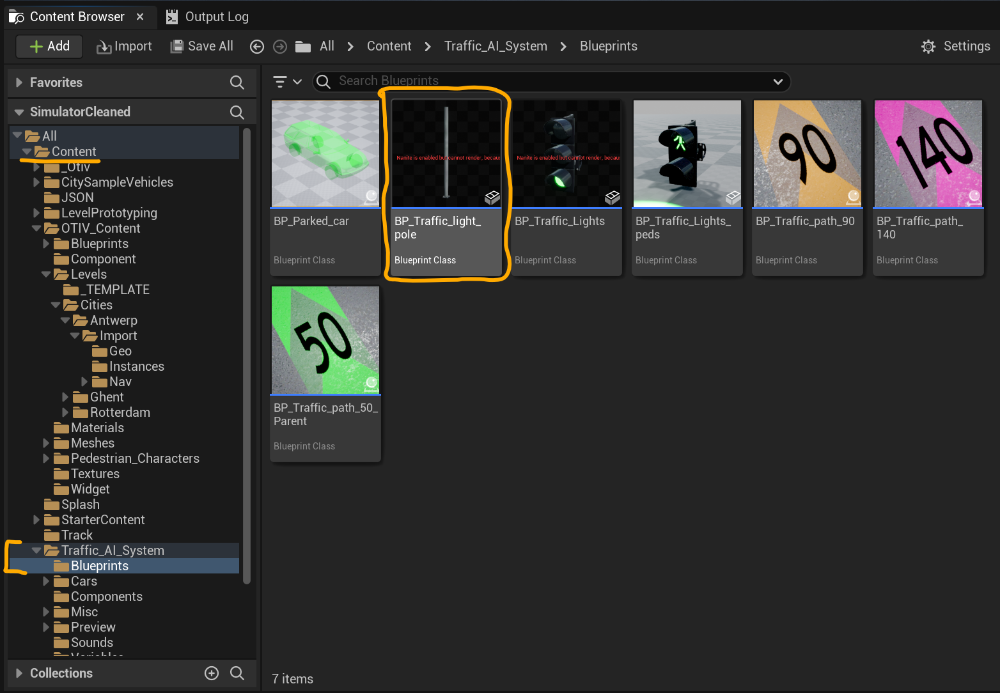
You can place these in the world like you did with the Geo or instances from the [City Generation](../CityGeneration/UnrealEngine.md) process. There are 3 versions that the pole can be: small, middle or large. The way to change this is by adjusting static mesh.
Make sure the Pole is selected, if it is --> go into the [details panel](../Softwares/HowToUnrealEngine.md#details-panel) and search for Static Mesh, it is both a tab and a variable and should look like this:
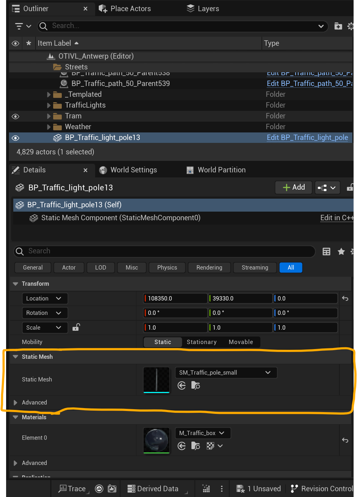
When you click on the variable where it says "SM_Traffic_pole_small, which is a drop down menu, you have to ability to select a different static mesh. For poles you have 2 options:
SM_Traffic_pole_small --> Small version
SM_Traffic_pole_middle --> Bigger version with space for overhanging light for single lane
SM_Traffic_pole_large --> Biggest version with space for overhanging light for 2 lanes
Depending on your intersection you want to one that fits your needs, i'll go with the middle one. Simply select, or search the name like they are written here. If you have selected one you should see the visual change in the [viewport](../Softwares/HowToUnrealEngine.md#viewport). You may want to [move or rotate](../Softwares/HowToUnrealEngine.md#how-to-moverotatescale-an-object) the pole depending on your needs.

Once the pole has been placed in your level you can attach a traffic light to it. So again select the road you wanted to add a traffic light to. Now we can bind the pole through dropdown or [eye dropper](../Softwares/HowToUnrealEngine.md#eye-dropper) to the Attach To variable so it should look like this:
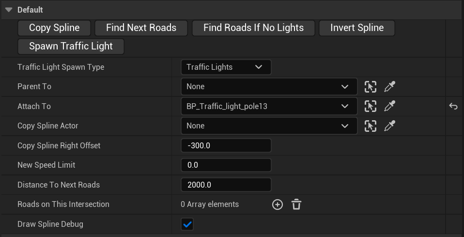
That should be everything that has to be set for a traffic light, the only thing left to do is to press the "Spawn Traffic Light" button
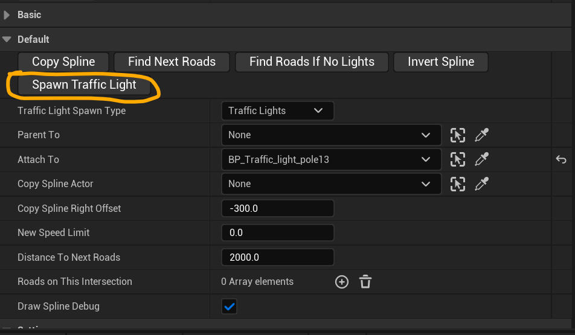
After you pressed the button, a traffic light should spawn on the placed pole like this:
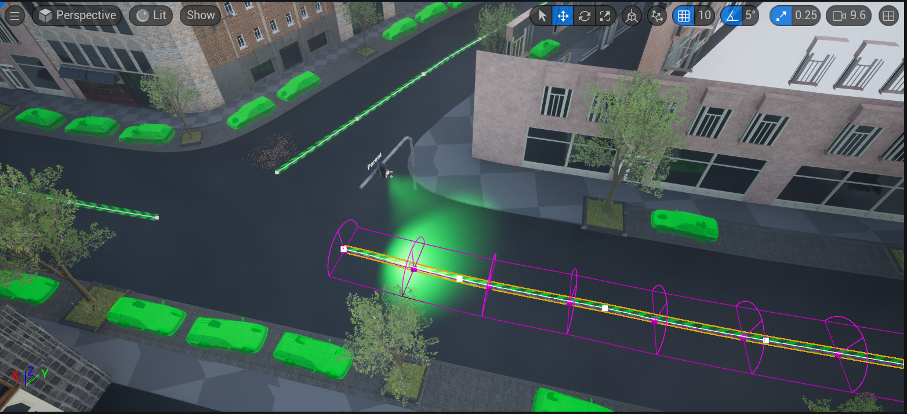

The next step is to repeat this process for all the street on this intersection, almost every step is the same except for the "Parent To" variable that can be found above the "Attach To" variable on the street. You want to select a traffic light here, make sure that there is only 1 parent at an intersection at the time, so all traffic lights on a single intersection should parent to the same traffic light.

At first even to you have set the parent variable, every traffic light will say "PARENT" above it, that is because the traffic lights themself needs to be configured and updated. For this you will have to select a traffic light, lets start with the one you chose to be the parent.
If you look in the [details panel](../Softwares/HowToUnrealEngine.md#details-panel) on the selected traffic light, you will find a tab called "settings"
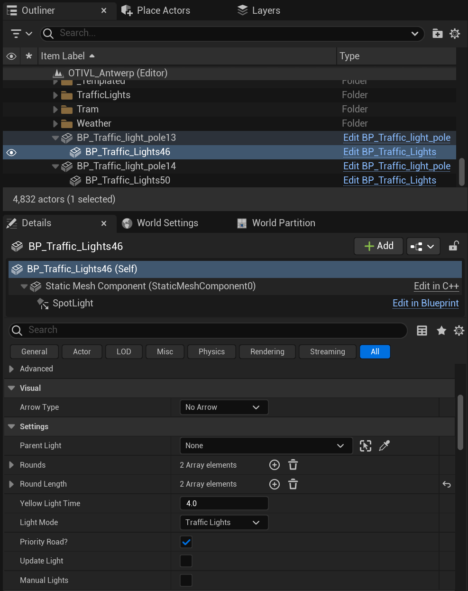
You can start off by updating the light, just to make sure everything is set correctly, there are a lot of settings here, but we will focus on a few

#### Rounds
This will tell on which round this traffic light will be green, say you have 3 streets that come together, you only want there to be one street where the traffic light shows green. So you will on one traffic light set its round to 1, on the next traffic light put it on 2, and so on.

You can add or remove round depending on your needs

Pretty self explaining...

#### Round Length
This as the name suggest will set the duration of each round. It is how long this round will show green before switching to the next, again pretty simple

#### Priority Road?
This settings is only necessary if you are working with priority roads and not traffic lights, it simple says this road is or isn't a priority road.

Okay so those are the basic settings you may want to adjust, the rounds are mainly to be configured on the main parent light, except for saying on which round they are green, that is to be configured on the light itself, the same counts for the Priority road checkBox.

If the current traffic lights isn't a parent and you update the light, it will switch colors.
Depending on the type of traffic light(normal or priority road) the color will be different.
The Main parent will show green for normal lights, while the other lights will show red
For priority lights will the lights that are set to be priority show blue, while the others will show orange.

Also after updating and adjusting all lights, the parent above the lights should only show on a single traffic light.

Another thing to add for priority lights is that they will not show during gameplay, so that means that when the simulator is running, those will dissapear and only their logic will be used!

## Finish
Okay that should be it, you should now have all knowledge to fix, adjust or add roads. You can find even more information on the traffic system [here](../TrafficPlugin/TrafficPlugin.md), but with this basic information you can make it at least work in a basic sense

After manually fixing all streets, [you can start packaging the project...](./Packaging.md)
