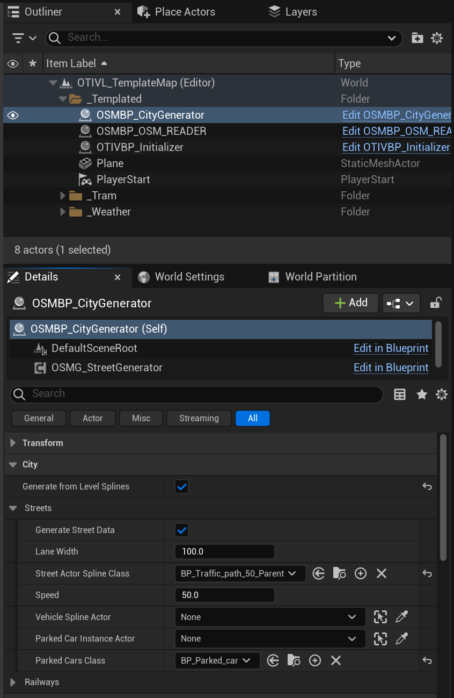

# Unreal Engine City Import

For questions about Unreal Engine you can go to this information page:

[What is Unreal Engine?](https://otiv-jonas-samyn.github.io/otivSimulator/docs/CityGeneration/UnrealEngine)

## Creating a New Level

When you launch Unreal Engine, you will see something like this:

You could be in a different start level, but that is fine. To start working on a new map, you want to create a new level. Here is how you do that:

1. On the top of your screen, hover over “**File**” and select “**New Level**”:

    

2. Select the `Otiv City Generation Template Map` and click the **Create** button. You should now load up a new level with some elements already in it:

    

## Saving the Level

Start by saving the level. You can press either **ctrl+s** or go to File → Save Current Level. A window will pop up asking where you want to save the level. It is recommended to stay with the previously made structure and save it under:

_Otiv → Levels → Cities_

1. Right-click on the empty space and create a new folder, naming it after the exported city (e.g., Rotterdam).
2. Enter the folder, name your level using the `OTIVL_` prefix (e.g., `OTIVL_Rotterdam`), and save it:

    

Your level should now be saved under the chosen name. To check, you can look at the top of the viewport where the name of the level should be:

## Importing City Parts

To import the city parts, go to the content browser and navigate to the folder where you saved your city. Add a new folder by right-clicking in the content browser, and name it “**Import**”:

Inside this folder, create three other folders named “**Geometry**”, “**Instances**”, and “**Navigation**”:

## Activating the Houdini Engine Plugin

Before importing the Houdini files, you need to activate the Houdini Engine plugin. Navigate to the top of your screen and open the “**Houdini Engine**” tab, then click the “**Create session**” button:

You are now connected to Houdini.

## Importing Geometry Files

1. Go into the “**Geometry**” folder. Open your file explorer and navigate to where you exported your city from Houdini. The folder should contain **Geo**, **Instances**, and **Nav** folders.
2. Go into the **Geo** folder, select all `.bgeo` geometry files, and drag and drop them into Unreal Engine.

    

Importing can take a while, so just wait. After a while, you should see all the files in Unreal Engine. There should be both Blueprints and Static meshes. We only care about the blueprints.

3. Drag and drop the blueprints into your level. Depending on the size of the exported city, you may want to place each file separately or all at once.

4. In the Outliner, select all the BP_???_Geo files, group them into a folder, and name it **Geometry**:

    

5. Reselect all your geometry objects, and in the details panel, reset their transforms (Location and Rotation should be 0, Scale should be 1):

    

## Importing Instances

Repeat the process for importing geometry, but now for the instances. Importing instances can be heavier than geometry, so be cautious when placing them into the level.

Group them into a folder in the Outliner, name it **Instances**, and reset their transforms.

After this is done, your level should look something like this:

## Removing Blockout

If you see an error with the buildings, this is because we imported both the instances and the blockout. Remove the blockout from your level. It should be under your geometry folder in the Outliner:

After deletion, your level should look something like this:

## Traffic generation process

In the outliner of the level you should see a folder called "_Templated", this contains some actors that the simulator needs to run

One of those is the OSMBP_CityGenerator, we will use this to generate the city.

When you select the OSMBP_CityGenerator from the outliner and check the details panel you will see all the variables that you can configure to achieve the city that you want:

The first thing you want to check is if the Generate from Level Splines checkbox is checked, you can find this on the details panel of OSMBP_CityGenerator under the "City" tab

Next step is to add the vehicle navigation splines that were exported from Houdini into the level, the city generator will use these to generate the vehicles streets. It should have been imported under Import/Nav and should be called "BP_Car_Connection_Nav"

You want to drop this into your level and reset its transform, you should now see some lines that go along the roads of your map.
Now back to the OSMBP_CityGenerator you want to go into the "City" tab, when you open it, you see 2 more tabs being called "Streets" and "Railways", we want to use the Streets tab.

A lot of the variables are not needed for us and so we shouldn't touch them, check the image if you are not sure if you changed something by accidant.

The first thing we want to change is the Vehicle Spline Actor, this is where we want to put our Vehicle Navigation actor that we just imported, for this I recommend using the eyedropper, or if you want you can also search for it by pressing the drop down menu next to the variable "Vehicle Spline Actor"

The dropmenu menu speaks for itself but for the eyedropper you can check here [how to use the Eye dropper tool](../Softwares/HowToUnrealEngine.md#eye-dropper)

Once you have selected the BP_Car_Connection_Nav, it should look something like this

Next step is the parked cars, this is a bit more work because currently Houdini doesn't export the Parked Cars as an Blueprint, but it puts it together with everything else from the Sidewalk
[How to split up the parked cars](../Softwares/HowToUnrealEngine.md)

Once they have been split into a seperate blueprint you want to drop them into the level.

After that once again go back to the OSMBP_CityGenerator from the Outliner and go into the details panel --> City --> streets
You should see a variable that is called "Parked Car Instance Actor"

Just like with the "Vehicle Spline Actor" we want to select the parked cars into this variable, again u can seach for it through the drop down menu or use the [eye dropper](../Softwares/HowToUnrealEngine.md#eye-dropper)

After doing that you are done to start generating the city, still on the "OSMBP_CityGenerator" under the City Tab there should be a tab called default which contains some buttons:

If you open the default tab and see the buttons, there should be a button called "Generate City Event", the only thing you need to do is to press that button and wait
After waiting a few seconds you should see something like this:

Thats it, you have now generator the city, but wait you still have to clean and fix a lot of things...
Lets start of with some Outliner cleaning, select all the generated parked cars from the outliner, they should be called something like "BP_Parked_car" and a number

So select them all and [combine them into a folder](../Softwares/HowToUnrealEngine.md#outliner-combining-into-folder)

Do the same for the generated streets, they should be called something like "BP_Traffic_path_50_Parent" and a number.

This will clean up the outliner quite a bit

Okay we can now delete the imported BP_ParkedCars and BP_Car_Connection_Nav that we imported from Houdini. We used them for the city generation but once it is generated these are redudant.
We want to delete them, in the outliner they should be called something like "BP_Car_Connection_Nav" and "BP_ParkedCars".

They could be in a folder for you so be sure to check everywhere. If you select them you can [delete them from the scene](../Softwares/HowToUnrealEngine.md#how-to-delete-an-actor-from-a-level)

The next step is fixing and configuring the streets so that everything works like you want to...

[Lets start fixing and configuring the streets](./StreetFixing.md)
