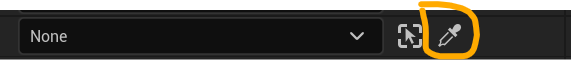
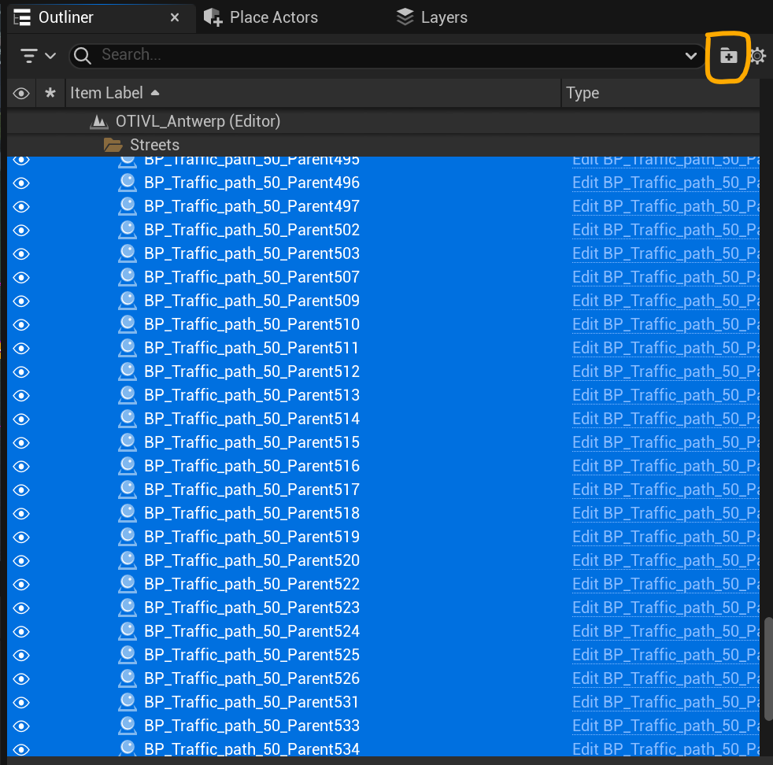
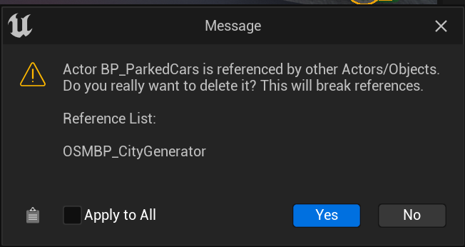
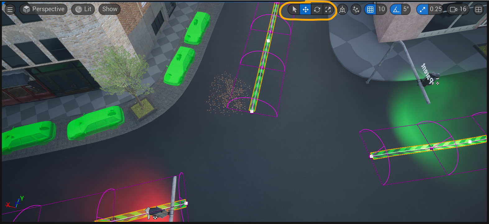

# How to Unreal Engine
On this page you will extra information about how to use Unreal Engine

## Panels and windows
The Unreal Engine editor works with panels and windows, each one doing something else

#### Outliner
The outliner panel contains all objects that are currently in the level, its default position is on the top right.

#### Details panel
The details panel will show details, information and variables of an object, when you select an object in either the outliner or through the viewport, the details panel will change containing all information about the selected object.

#### Content browser
The content browser is the file explorer of your Unreal Engine project, it contains all the files that you can acces in Unreal Engine.

#### Viewport
The viewport is the main way to use Unreal Engine, it is the way to see what is currently in your level.

## Eye dropper
The eye dropper is a simple selection tool provided by Unreal Engine, it can be recognized by this symbol:

And can mostly be found next to a variable where you have to select/insert an object.

The way it works is quite simple, when you select it a box should appear next to your cursor, it will tell you to select an actor.
To select an actor simply go on over to the [viewport](../Softwares/HowToUnrealEngine.md#viewport) and click on the object you want to add, it may be diffilcult for some actors, for example splines, the trick here is to press a point of the spline(little square) but even so can the eye dropper be easier to use than finding the name in the [outliner](../Softwares/HowToUnrealEngine.md#outliner)

## Outliner combining into folder
Keeping the outliner clean is the best way to work, it makes it easier to find and adjust the objects in the level. The best way to do this is by putting objects into folders. You can either drag these one by one or you can select a bunch of them and generate a folder around them.

To do this go into the outliner and select all the actors you want to put into a folder.
After you have selected them all you want to press the folder with + icon on the top right of the outliner:

Once you have pressed this button, all your objects should get moved into the just created folder, renaming can be done right after the creation of the folder by just start typing or by selecting the folder and pressing F2 on your keyboard.

## How to delete an actor from a level
Sometimes and actor or object is no longer needed in your level and thus should get deleted. Again is this quite easy, start by selecting the object, this can be either done in the [viewport](../Softwares/HowToUnrealEngine.md#viewport) or in the [outliner](../Softwares/HowToUnrealEngine.md#outliner), once it is selected simply press the delete key on your keyboard and the object should be gone.

It is possible that this message pops up

This shows up because we linked the actor to another actor, most of the time it is okay to just press okay if the connection is no longer needed, but be carefull if for example you work with the roads and you delete a road that has a connection, it will show a none connection which can give errors, the connection itself should thus be removed from the list also.

## How to move/rotate/scale an object
Unreal Engine is a 3D software, which means we can transform objects in 3D space.
On the top of the [viewport](../Softwares/HowToUnrealEngine.md#viewport) you can see these symbols

The first of the bunch is the simple cursor
The second one is moving in 3D space(also w on keyboard)
The third one is rotating(also E on keyboard)
The fourth one is scaling(also R on keyboard)

## What are splines and how to use them
In the simulator we work a lot with splines, a big example is the traffic system.
Splines are points that are connection with a line, this line can be straight but can also curve depending on the tangent value of the points.
You fully move or rotate spline points in 3D space and you will see them move in the [viewport](../Softwares/HowToUnrealEngine.md#viewport)
If you select a point, you can also delete just like an object, or you can add a point by ALT + Drag, for a full explaination or a video I would search the internet but this should be a simple explaination.