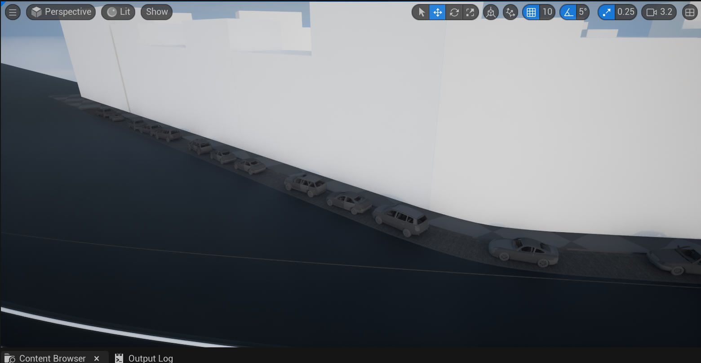

# Streets
The streets are the main part of this plugin, they will take spawning the car, and telling them where to drive.
The streets are based on splines and can thus be placed very easily, but for them to work fully you have to configure them.

Streets have a visual on them that tells the direction and speed of the streets

You can configure a lot of different things:

## Street connections
Street connections will say the street what street follows so that when the car arrives at the end of its current path it can continue to the next one.

The streets have a button, this will search for nearby streets to connect to automatically, but this doesn't always work well, so for more complex connections I recommend going over and fixing them manually.

You can connect streets like this:

## Parallel streets
Parallel streets are streets that run parallel to eachother, pretty obvious right. But what does it do. When you configure street to be parallel, it will give vehicles the ability to switch between them. This can lead to more complex behavior which is very nice.

You can configure it like this:

## Speed
The speed is also configured per street. It is pretty easy to change and can be visually checked in the editor, streets will have a different color depending on their speed aswell as text visualizing the speed.

You can configure the speed like this:

## Traffic lights
Traffic lights will make intersection logic better, it will tell what cars can drive and which one has to wait, but these have to be setup.

Each intersection has one parent traffic light, this one will control the others. A street has a button to spawn in a traffic light but this will spawn in a traffic light that is floating above the street. You can also add poles and on the street add this pole as attach actor, on the same place you can select the parent traffic light aswell, once you have done that, you can press the spawn button, you now have traffic lights.

The only thing left to do now is to configure the different loops, on the main traffic light, the parent of all the others you can configure this.

How to setup --> spawn --> configure the traffic lights:
